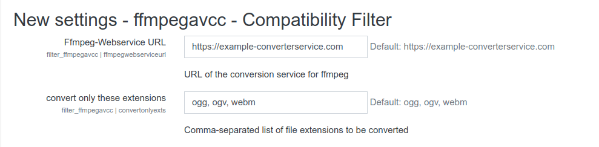

# Moodle Ffmpeg based HTML5 audio/video to MP4 filter

This Plugin is based on the HTML5 audio/video to MP4 filter from [Nicolas Dunand](https://github.com/ndunand/moodle-filter_html5avtomp4) and changes its implementation in a way that all ffmpeg conversions are executed by a webservice. This allows users to profit from the functionality provided by the filter without the necesserity to have  `ffmpeg` installed on your Moodle Server.

## About

> This filter allows the automated creation of MP4 sources for HTML5 `<audio>` and `<video>` elements.
>
>This is particularly useful if some users are using [atto_recordrtc](https://docs.moodle.org/37/en/RecordRTC) because most browsers create `.ogg` files for audio and `.webm` files for video, which are not playable in Safari.
>
>This plugin then checks for the existence of an `mp4` source in the same file area and provides it automatically if it exists. In the case the `mp4` source does not exist, it is created via a scheduled task.

This filter extends the original functionality in a way that `audio` elements are converted to a compatible audio format (`mp3`) whereas `video` elements are converted to `mp4`.

## Requirements

A running ffmpeg-conversion-webservice and its url to be set in plugin settings.

## Installation

You need to at least:

1. set the `ffmpegwebserviceurl` in the plugin settings.

You can also specify the file-extensions that should be converted by the filter.

Optionally you can:

* change the other plugin settings as required,
* tweak the execution times of the scheduled task running the file conversions.
