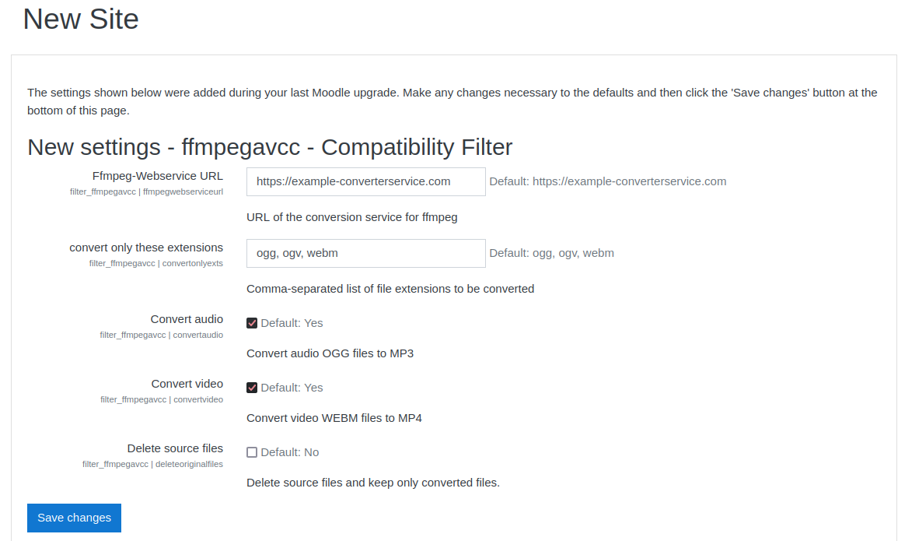

# Moodle Ffmpeg based HTML5 audio/video to MP4 filter

This Plugin is based on the HTML5 audio/video to MP4 filter from [Nicolas Dunand](https://github.com/ndunand/moodle-filter_html5avtomp4) and changes its implementation in a way that all ffmpeg conversions are executed by a webservice. This allows users to profit from the functionality provided by the filter without the necesserity to have  `ffmpeg` installed on your Moodle Server.

## About

> This filter allows the automated creation of MP4 sources for HTML5 `<audio>` and `<video>` elements.
>
>This is particularly useful if some users are using [atto_recordrtc](https://docs.moodle.org/37/en/RecordRTC) because most browsers create `.ogg` files for audio and `.webm` files for video, which are not playable in Safari.
>
>This plugin then checks for the existence of an `mp4` source in the same file area and provides it automatically if it exists. In the case the `mp4` source does not exist, it is created via a scheduled task.

This filter extends the original functionality in a way that `audio` elements are converted to a compatible audio format (`mp3`) whereas `video` elements are converted to `mp4`.

## Requirements

A running ffmpeg-conversion-webservice and its url to be set in plugin settings.

## Installation

[Note: Make sure that the [conversion webservice](https://github.com/team-parallax/dynamic-conversion-service/blob/main/README.md) is running before trying to use the ffmpegavcc-filter]

1. Create a `.zip` archive of the ffmpegavcc-filter. For example via the CLI in the project root directory with:
    ```console
    zip -r -u ffmpegavcc.zip ./ffmpegavcc
    ```
2. Make sure your moodle instance and moodle database is running
3. With an admin account log into moodle and head to `Dashboard / Site administration / Plugins / Install plugins`
4. Under `Install plugin from ZIP file` select `Choose a file...` and choose the `ffmpegavcc.zip` that was created in step 1
5. Click the `Install plugin from the ZIP file` button and click `Continue`/`Upgrade Moodle database now` until you reach the settings page
6. Adapt the plugin settings to your liking [Make sure to at least set the `Ffmpeg-Webservice URL`]

Optionally you can:
   * specify the file-extensions that should be converted by the filter
   * choose whether to convert audio or video files
   * delete the source file after a file was converted
   * tweak the execution times of the scheduled task running the file conversions
7. Head to `Dashboard / Site administration / Plugins / Filters / Manage filters`
8. Activate the `ffmpegavcc - Compatibility Filter` and move it to the top via the arrow buttons
9. Optionally: Head to the `Settings` of the `ffmpegavcc - Compatibility Filter` and click `Test Connection to Ffmpeg-Webservice` to make sure that the connection to the webservice is working as intended
[Hint: Here you may also change the settings you made in the installation step earlier]
